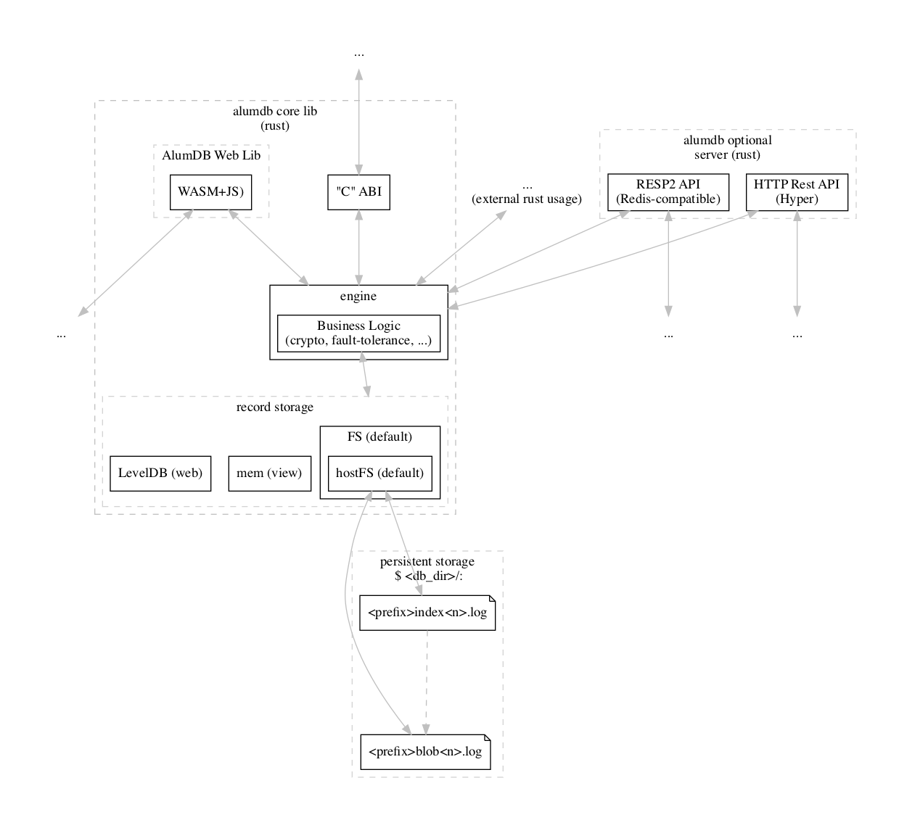

  

AluminiumDB (AlumDB) is an embeddable append-log written in
Rust that can optionally be used via a server as well.
However database is designed for client-only use cases,
with the possibility of a client syncing its Database
between different platforms P2P.

If you want a client->server DB there are plenty of better
options available. If you look for a (Rust) embeddable DB however
that can be used as the storage for your Application,
than AlumDB might be what exactly what you need.

> **WARNING**: this database is highly experimental,
> and while we do plan to dogfeed on it as soon as we can for some of our own applications,
> it is not advised to use it in a production environment already.
>
> Please e-mail [glen@plabayo.tech](mailto:glen@plabayo.tech) in case you want to
> contribute to AlumDB, you have feedback or are interested in using it for your application.

Progress towards a first alpha-release of AlumDB is tracked in [the Roadmap section](#roadmap).

## Design

  

### Models

The data is stored in files, called blobs. Each blob can have an index file. It is however only the blob
which is critical as an index can always be created (again) from a blob file). All files are to be used
in append/read only mode. Never-ever should existing data within a file be deleted or modified. The index
contains entries, where each entry stores the start position and length of the record it points too. The entry
itself is always fixed size, allowing for efficient key scanning.

All numbers are to be encoded and decoded as LittleEndian.

#### Blob

> **File Path**: "`<db_dir>/blob_<n>.log`"
>
> with:
> - `n` is the ordered sequential blob index, starting from `0`;
> - `prefix` an optional constant that can be configured for an `alumdb` instance;
> - `db_dir` being the directory used to store the `alumdb` instance;

A blob can have an unlimited amount of records (your data) or a fixed amount of data based on record count or total data size. By default a blob grows unlimited unless specified in its header otherwise.

A blob can also be safely removed without corrupting the rest of the database, but best to only do so once all users of those files have been put offline.

| `blob_header` | `blob_meta` | `record#1` | `record#2` | ... | `record#n` |
|---------------|-------------|------------|------------|-----|------------| 
| 130 *B*       | n *B*       | x *B*      | y *B*      | ... | z *B*      |

##### Blob Header

| `magic` | `version` | `flags` | `blob_meta_size` | `record_key_size`  | `record_meta_size` | `record_data_size` | `max_records` | `public_key` | `header_checksum` |
|---------|-----------|---------|------------------|--------------------|--------------------|--------------------|---------------|--------------|-------------------|
| 8 *B*   | 4 *B*     | 2 *B*   | 4 *B*            | 4 *B*              | 4 *B*              | 4 *B*              | 4 *B*         | 32 *B*       | 64 *B*            |

- `magic` is an opaque constant to identify the file type: `0x616C6462626C6230` (7020096292884603440);
- `version` consist of the year (first 2 byes, e.g. 2022), the revision number (third byte) and the patch number (last byte):
  - a year bump can contain backwards incompatible changes;
  - revision bumps are to be considered backwards-incompatible within the same year, but are usually introducing new features / major changes;
  - a revision number of `0` is to be considered a pre-release and can break on a frequent basis;
  - patch numbers ae bumped for small fixes / updates;
  - older revision versions receive no updates;
  - older year versions receive only patches for their last revision for critical issues and require a motivational request or patch contribution from a community member;

The current version is `2022.0.0`, which is `132513792` in decimal and `07 E6 00 00` in hex.

Blob Header Flags (starting from the lift, one column per bit, omitting unused bits):

| `bit` | `name` | `description` |
|-------|--------|---------------|
| 0 | `allow_duplicate_keys` | If set duplicate keys are allowed, otherwise it is the key on the smallest offset which is to be used |
| 1 | `deduplicate_as_last`  | This flag can be only set if `allow_duplicate_keys` is not set. When this flag is set the DB engine is instructed to use the key with the largest offset when multiple positions of the same key are found. |
| 2 | `fixed_size_records` | If set all records are the same size and the `record_data_size` in the header will define the fixed size of each record in bytes (not including its header and meta-data). By default this flag is not set and instead records can have dynamic size in which case the `record_size` defines the max allowed record size (in bytes) instead. |
| 3 | `max_records_as_bytes` | Interpret max_records as `bytes` rather than as a "count of records". |
| 8 | `ed25519_crypto` | Use [Ed25519][ed25519] for encryption of records and signing of header (used as checksum), otherwise [CRC-64][crc] is used for the checksum (remaining bytes are 0-filled). When this flag is set both the `record_key_size`, `record_meta_size` and `record_data_size` refer to the cipher version of the key and record data. |
| 9 | `plain_key` | Can be set only if `ed25519_crypto` is set and indicates if the keys should be stored as plain text and thus not be encrypted. This makes it cheaper to read but does mean the key data is to be considered public and is also no longer tamper proof. Corruption errors are however still detected via the regular checksum. If this flag is set it also means the `record_key_size` is in fact the actual byte size of the plain bytes of the encoded key |

##### Blob Record

| `record_header` | `record_meta`            | `record_data` |
|-----------------|--------------------------|---------------|
| 9+`record_key_size` *B*           | `record_meta_size` *B*   | m *B*         |

> The size of record data (`m`) is a constant in case the `fixed_size_records` (blob) flag is used.

- `record_meta` content is optional and if defined it is of a fixed size with its content opaque to `alumbdb` and used as raw binary data;
- `record_data` content is also opaque to `alumbdb` and used as raw binary data;
- both `record_meta` and `record_data` _have_ to be decrypted prior to reading in case the blob `ed25519_crypto` is set;

###### Blob Record Header

| `checksum` | `record_key`             | `data_size`   | `record_flags` |
|------------|--------------------------|---------------|----------------|
| 4 *B*      | `record_key_size` *B*    | 4 *B*         | 1 *B*          |

- [CRC-32][crc] is used for the `checksum`, no signature alternative available,
  instead when `ed25519_crypto` is used both the `record_key` and `record_data` are encrypted;
- record flags aren't yet used, but are reserved for future usage, for now it is expected to be `0`;

[ed25519]: https://ed25519.cr.yp.to/
[crc]: https://en.wikipedia.org/wiki/Cyclic_redundancy_check

#### Index

> **File Path**: "`<db_dir>/<prefix>_index_<n>.log`"
>
> with:
> - `n` is the ordered sequential **blob** index;
> - `prefix` an optional constant that can be configured for an `alumdb` instance;
> - `db_dir` being the directory used to store the `alumdb` instance;

An index file is linked to [a blob](#blob). It is an optimization and can be recovered from [the blob](#blob)
should the index file be (partly) corrupted or missing. It is used for reading purposes only.

| `index_header` | `index_meta` | `entry#1`  | `entry#2`  | ... | `entry#n  `|
|----------------|--------------|------------|------------|-----|------------| 
| 144 *B*        | n *B*        | x *B*      | y *B*      | ... | z *B*      |

##### Index Header

| `magic`   | `blob_header_checksum` | `index_meta_size` | `entry_meta_size` | `index_header_checksum` |
|-----------|------------------------|-------------------|-------------------|-------------------------|
| 8 *B*   | 64 *B*                 | 4 *B*             | 4 *B*             | 64 *B*                  |

- `magic` is an opaque constant to identify the file type, it is different from the constant used for blobs: `0x616C646269647830` (7020096293001525296);
- `blob_header_checksum` is a copy of the checksum found in the linked blob's header;
- `index_meta_size` defines the size of the opaque optional (index) meta data following the index header, and is not used by `alumdb` for any purposes;
  - Note that both the `index_meta_size` and  `entry_meta_size` defines the
    size of the cipher version (of the index meta encoded data) in case
    [the blob](#blob) `ed25519_crypto` flag is used;
- Uses [Ed25519][ed25519] for encryption for signing of (index) header (used as checksum) in case the [the blob](#blob) `ed25519_crypto` flag,
  otherwise [CRC-64][crc] is used for the checksum (remaining bytes are 0-filled);

##### Index Entry

| `checksum` | `record_key`             | `record_checksum` | `record_data_offset` | `record_data_size` |
|------------|--------------------------|-------------------|----------------------|------------------|
| 4 *B*      | `record_key_size` *B*    | 4 *B*             | 4 *B*                | 4 *B*            |

- [CRC-32][crc] is used for the checksum of the entire entry (minus the checksum), no signature alternative available,
  crypto verification is achieved because `record_key`, `record_meta`, `index_meta` and `record_data`
  is all encrypted and thus is to be decrypted prior to be able to use it;
- if `entry_meta_size` is greater than 0 you are to interpret the `index_meta_size` bytes following an entry
  as meta attached to that entry;
- `record_checksum` _must_ match the checksum of the record as fund in the `record_header`;

## Roadmap

Please consult [the Projects page at GitHub](https://github.com/plabayo/alumdb/projects?type=beta)
for a detailed and up to date planning of all the different milestones.

However, here is more or less the traject —in order— that AlumDB's development is following:

- [ ] AlumDB PoC in Rust only, with unit- and integration tests;
- [ ] Python example up and running for the "C" ABI;
- [ ] iOS Swift App Example;
- [ ] WASM+JS Library + WebApp example;
- [ ] Initial version of the AlumDB server;
  - [ ] RESP2 Rust Module;
  - [ ] (Hyper) REST API Rust Module;
- [ ] Documentation, Iteration & Improvements;
- [ ] Benchmarks;
- [ ] Website (built using [TSG][tsg]);
- [ ] `2022.0.1`, the first alpha release, ready to dogfeed;
- ...
- [ ] `2022.1.0`, first stable release (Q4 of 2022);

[tsg]: https://github.com/plabayo/tsg
